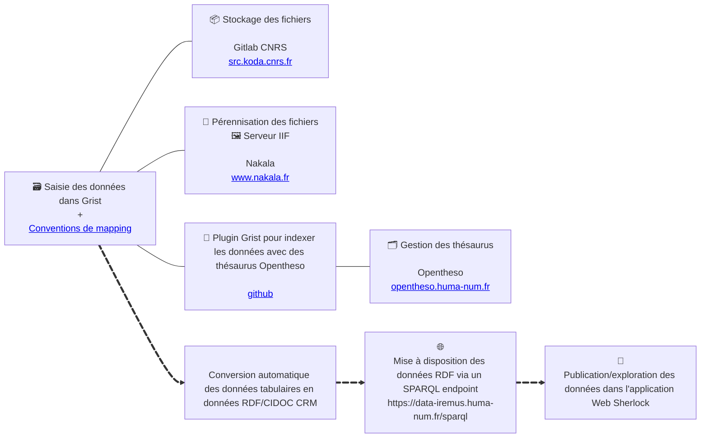

# `📡 SHERLOCK`

 
 

    

 
 

SHERLOCK est un programme de recherche/ingénierie porté par
l'[Institut de Recherche en Musicologie](https://www.iremus.cnrs.fr/) et le
[Consortium Musica*](https://musica.hypotheses.org/) de
l'[IR* Huma-Num](https://www.huma-num.fr/).

SHERLOCK vise la construction d'une chaîne de collecte et de publication de
données pour la recherche en humanités (en particulier, pour la musicologie)
autour de l'ontologie [CIDOC CRM](https://cidoc-crm.org/).

<!--
À cette fin, SHERLOCK
articule :

- des réflexions méthodologiques et techniques autour de l'usage du CIDOC CRM
  comme ontologie centrale dans un système d'information scientifique
  collaboratif :
  - [Modéliser les données de la recherche avec le CIDOC CRM](https://hal.science/hal-05548446)
    ([💾](https://github.com/Amleth/communications/blob/main/20260312-cm-crm/main.typ)),
    journée d'étude du Consortium Musica*, 12 mars 2026.
- des scénarios de mise en œuvre d'applications existantes comme Grist, Nakala
  ou Opentheso
  ([sherlock-grist-to-crm](https://github.com/sherlock-iremus/sherlock-grist-to-crm/blob/main/doc/mapping.md),
  [sherlock-grist-opentheso-plugin](https://github.com/sherlock-iremus/sherlock-grist-opentheso-plugin))
- le développement de nouvelles
  applications ([sherlock-app](https://github.com/sherlock-iremus/sherlock-app))
- le développement de scripts de transformation de données
  ([grist-nakala](https://github.com/sherlock-iremus/grist-nakala))
- des
  [données musicologiques](https://github.com/sherlock-iremus/iremus-sherlock-data-ttl)
  sémantiques modélisées avec le CIDOC CRM

  https://github.com/Amleth/consortium-musica2-gt2-ontologies/tree/main/guide
  https://tonalities.gitpages.huma-num.fr/start/
  -->

## `⛩️ Schéma d'ensemble`

## `🌸 Quelques vue de l'application SHERLOCK`

- [Identité d'une ressource](https://data-iremus.huma-num.fr/sherlock/projects/mercure-galant/livraisons/1672-01)
- [Structure d'une œuvre + recherche plein-texte dans les composants](https://data-iremus.huma-num.fr/sherlock/projects/mercure-galant/livraisons/1672-01)
- [Contenu d'un périodique](https://data-iremus.huma-num.fr/sherlock/projects/mercure-galant/livraisons)
- [Annotations (E13) sur une ressource](https://data-iremus.huma-num.fr/sherlock/id/355f3c4d-7b7c-472f-9b66-974a819f9eaf)
- [Ressources liées](https://data-iremus.huma-num.fr/sherlock/id/355f3c4d-7b7c-472f-9b66-974a819f9eaf)
- Visionneuses simples :
  - [TEI](https://data-iremus.huma-num.fr/sherlock/projects/mercure-galant/articles/1677-05_211)
  - [MEI](https://data-iremus.huma-num.fr/sherlock/?resource=https://www.nakala.fr/10.34847/nkl.48576349)
  - [image](https://data-iremus.huma-num.fr/sherlock/id/f28b62fc-d686-4c78-a205-015e5d7dc4b6)
- [Recherche plein texte multi-champs dans les ressources d'une collection](https://data-iremus.huma-num.fr/sherlock/projects/aam)
- [Spécification du futur composant de recherche de ressources par descripteurs](https://github.com/sherlock-iremus/sherlock/blob/main/spec_app_search.md)

<!-- https://yasgui.triply.cc/#query=SELECT%20%3Fgraph%20(COUNT(*)%20AS%20%3Ftriples)%0AWHERE%20%7B%0A%20%20GRAPH%20%3Fgraph%20%7B%0A%20%20%20%20%3Fs%20%3Fp%20%3Fo%20.%0A%20%20%7D%0A%7D%0AGROUP%20BY%20%3Fgraph%0AORDER%20BY%20DESC(%3Ftriples)&endpoint=https%3A%2F%2Fdata-iremus.huma-num.fr%2Fsparql&requestMethod=POST&tabTitle=Query&headers=%7B%7D&contentTypeConstruct=application%2Fn-triples%2C*%2F*%3Bq%3D0.9&contentTypeSelect=application%2Fsparql-results%2Bjson%2C*%2F*%3Bq%3D0.9&outputFormat=table -->