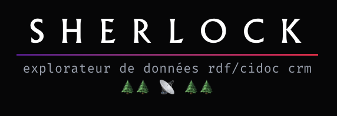
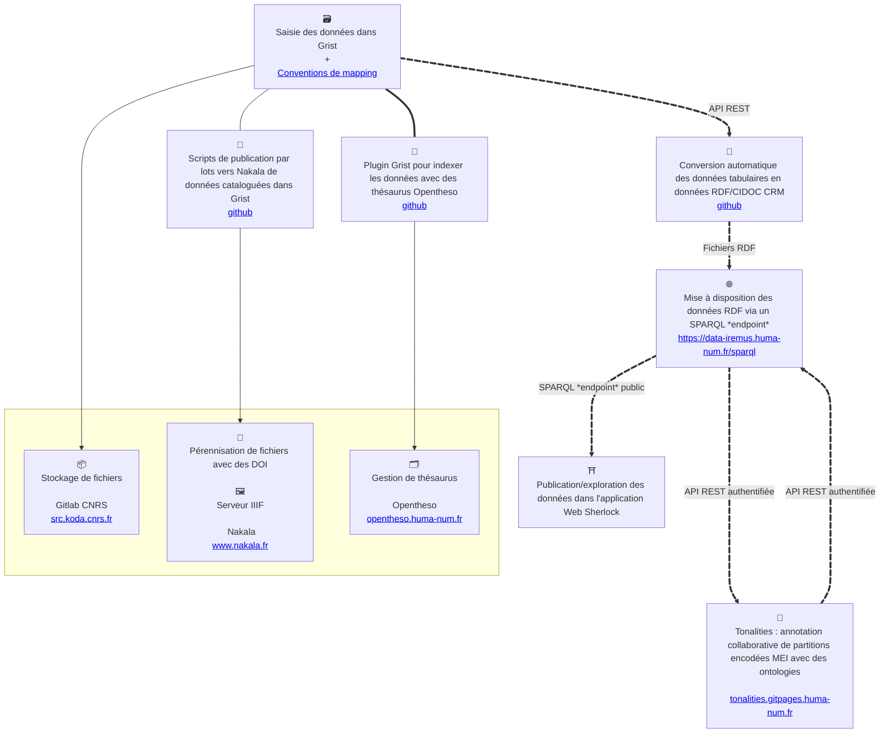

# `📡 SHERLOCK`

 
 

    

 
 

**SHERLOCK est un programme de recherche/ingénierie porté par
l'[Institut de Recherche en Musicologie](https://www.iremus.cnrs.fr/) et le
[Consortium Musica*](https://musica.hypotheses.org/) de
l'[IR* Huma-Num](https://www.huma-num.fr/).**

🏮 SHERLOCK propose une chaîne de traitement des données de la recherche sur le
patrimoine (en particulier, musical) autour de l'ontologie standard
[CIDOC CRM](https://cidoc-crm.org/), accompagnant le chercheurs des premiers
temps de son projet jusqu'à la publication et la valorisation de ses données
dans le contexte du Web sémantique. Il articule : des outils gestion de données
durables existants (Grist, Nakala), des méthodologies et des standards de
gestion des données de la recherche (IIIF, RDF, SKOS, TEI, MEI…) et le
développement d'interfaces Web d'exploration.

🌵 SHERLOCK entend rendre accessible la production et la publication de données
sémantiques. Faire monter en compétence autour de ces questions. À l'issu des
formations sur le Web sémantique, les chercheurs qui y assistent ressortent
souvent en disant : _« Le Web sémantique et les ontologies c'est très
intéressant, mais comment je fais concrètement pour produire des données
conformes ? »_.

## `🌄 Obstacles levés`

`🛠️ Produire des données sémantiques avec des outils ergonomiques`

- 🔒 _Il n'existe pas d'outils de saisie de données RDF/CIDOC CRM suffisamment
  ergonomiques et proches des pratiques ordinaires des chercheurs. Ceci
  constitue un frein dans la production de données sémantiques._
- 🔑 Nous nous appuyons sur l'outil _nocode_ [Grist](https://www.getgrist.com/)
  — qui propose une interface de type tableur tout en ajoutant la collaboration
  temps-réel, un système de droits, la construction de formulaires personnalisés
  et une API REST complète — et le complétons par un
  [outil de génération de données RDF/CIDOC CRM reposant sur des règles de _mapping_ simples](https://github.com/sherlock-iremus/sherlock-grist-to-crm).

`⚖️ Pérenniser les données`

- 🔒 _Les chercheurs manquent d'accompagnement et d'outils pour publier et
  pérenniser les données des projets de recherche en respectant les principes du
  [FAIR](https://www.go-fair.org/fair-principles/) et du
  [LOD 5⭐](https://5stardata.info/fr/) attendus par nos tutelles et par les
  organismes financeurs de la recherche, notamment depuis la loi pour une
  République numérique de 2016._
- 🔑 La centralité des technologies du Web sémantique (RDF, SPARQL _endpoint_)
  et de l'ontologie standard CIDOC CRM dans SHERLOCK permet de satisfaire ces
  contraintes.

`⛩️ Publier et explorer des données sémantiques`

- 🔒 _Le CIDOC CRM est une ontologie permettant d'exprimer avec une grande
  précision la subtilité des données de la recherche. Mais leur mise en
  visibilité sur le Web, notamment en lien avec les fichiers des corpus auxquels
  elles se réfèrent et en lien avec les concepts des référentiels qu'elles
  convoquent, demande des efforts de développements significatifs en matière
  d'interface Web._
- 🔑
  L'[application Web SHERLOCK](https://github.com/sherlock-iremus/sherlock-app)
  est un outil générique d'exploration de graphes de données RDF, tirant parti
  de la structure du CIDOC CRM. Voici quelques vue :
  - [Identité d'une ressource](https://data-iremus.huma-num.fr/sherlock/projects/mercure-galant/livraisons/1672-01)
  - [Structure d'une œuvre + recherche plein-texte dans les composants](https://data-iremus.huma-num.fr/sherlock/projects/mercure-galant/livraisons/1672-01)
  - [Contenu d'un périodique](https://data-iremus.huma-num.fr/sherlock/projects/mercure-galant/livraisons)
  - [Annotations (E13) sur une ressource](https://data-iremus.huma-num.fr/sherlock/id/355f3c4d-7b7c-472f-9b66-974a819f9eaf)
  - [Ressources liées](https://data-iremus.huma-num.fr/sherlock/id/355f3c4d-7b7c-472f-9b66-974a819f9eaf)
  - Visionneuses simples :
    - [TEI](https://data-iremus.huma-num.fr/sherlock/projects/mercure-galant/articles/1677-05_211)
    - [MEI](https://data-iremus.huma-num.fr/sherlock/?resource=https://www.nakala.fr/10.34847/nkl.48576349)
    - [image](https://data-iremus.huma-num.fr/sherlock/id/f28b62fc-d686-4c78-a205-015e5d7dc4b6)
  - [Recherche plein texte multi-champs dans les ressources d'une collection](https://data-iremus.huma-num.fr/sherlock/projects/aam)
  - [Spécification du futur composant de recherche de ressources par descripteurs](https://github.com/sherlock-iremus/sherlock/blob/main/spec_app_search.md)

`🏷️ Indexer les données avec des thésaurus SKOS`

- 🔒 _Les outils de gestion des données sont dissociés des outils de gestion des
  thésaurus._
- 🔑 Nous avons développé un
  [plugin Grist](https://github.com/sherlock-iremus/sherlock-grist-opentheso-plugin)
  se connectant à [Opentheso](https://opentheso.huma-num.fr/) pour indexer les
  données tabulaires.

`🪎 Gérer le cycle de vie des fichiers`

- 🔒 _Les outils de gestion du cycle de vie des fichiers sont dissociés des
  outils assurant leur catalogage scientifique._
- 🔑 Nous avons développé un
  [outil de publication par lots dans Nakala à partir de Grist](https://github.com/sherlock-iremus/sherlock-deno).

`🧠 Modéliser les données complexes de la musicologie`

- 🔒 _Trouver la bonne information ou la bonne formation pour monter en
  compétence sur la modélisation sémantique des données musicologiques n'est pas
  évident._
- 🔑 Les travaux de modélisation des données musicologiques menés dans le cadre
  du programme SHERLOCK à l'IReMus résonnent au niveau national via les actions
  de formations du [Consortium Musica*](https://musica.hypotheses.org/). Cela se
  traduit par des journées de formation, des journées d'étude, un
  [guide](https://github.com/Amleth/consortium-musica2-gt2-ontologies/tree/main/guide),
  et une disponibilité de l'équipe SHERLOCK auprès des chercheurs pour les
  accompagner dans leurs tâches de modélisation.

`💾 Recourir à des outils durables`

- 🔒 _L'état de l'art des outils de gestion de données est vaste, et il peut
  être difficile de s'y orienter et de prendre les bonnes décisions, notamment
  pour ce qui relève de la durabilité._
- 🔑 SHERLOCK fait le choix de [Grist](https://www.getgrist.com/) comme
  environnement d'édition des données par les chercheurs. Il s'agit d'un
  logiciel libre dont
  l'[état français](https://lasuite.numerique.gouv.fr/produits/grist) fait la
  promotion et participe à la maintenance depuis 2024. SHERLOCK s'appuie
  également sur des standards documentaires et informationnels à tous les
  niveaux de la chaîne de traitement des données (IIIF, RDF, CIDOC CRM, SKOS,
  MEI, TEI), et sur des outils durables proposés par nos institutions (comme
  [Nakala](https://www.nakala.fr) ou
  [Opentheso](https://opentheso.huma-num.fr)).

<!--
  [sherlock-grist-opentheso-plugin](https://github.com/sherlock-iremus/sherlock-grist-opentheso-plugin))
- le développement de nouvelles
  applications ([sherlock-app](https://github.com/sherlock-iremus/sherlock-app))
- le développement de scripts de transformation de données
  ([grist-nakala](https://github.com/sherlock-iremus/grist-nakala))
- des
  [données musicologiques](https://github.com/sherlock-iremus/iremus-sherlock-data-ttl)
  sémantiques modélisées avec le CIDOC CRM

  -->

## `🍱 Schéma technique d'ensemble`

## `📡 Communications significatives`

- ⛩️ Thomas Bottini. Modéliser les données de la recherche avec le CIDOC CRM.
  Journée d'étude _« Partager les données des SHS sur le Web sémantique »_,
  Consortiums Huma-Num Musica* et MASA, Mar 2026, Paris, France.
  [⟨hal-05548446⟩](https://hal.science/hal-05548446v1)
- 🧠 Thomas Bottini. Le CIDOC-CRM pour capter l'activité critique sur les
  sources en musicologie. _Rencontres de la musicologie numérique_, Consortium
  Musica 2, Dec 2022, Paris, France.
  [⟨hal-03950324⟩](https://hal.science/hal-03950324v1)
- 🎼 Thomas Bottini. Quelle infrastructure pour l'annotation sémantique
  collaborative de partitions MEI ?. Rencontres de la musicologie numérique,
  Consortium Musica 2, Dec 2022, Paris, France.
  [⟨hal-03950321⟩](https://hal.science/hal-03950321v1)
- 🎼 Thomas Bottini, Christophe Guillotel-Nothmann, Marco Gurrieri, Félix
  Poullet-Pagès. Tonalities: a Collaborative Annotation Interface for Music
  Analysis. _Musical Heritage Knowledge Graphs workshop during the 22nd
  International Semantic Web Conference 2022_, Oct 2022, Hangzhou, China.
  [⟨hal-03923731⟩](https://hal.science/hal-03923731v1)
