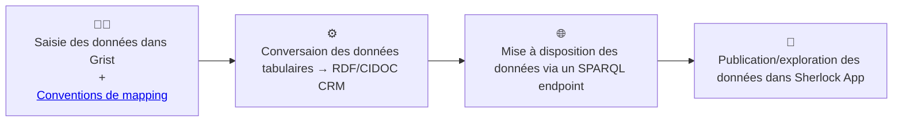

# SHERLOCK 📡

Cette page est le point d'entrée du programme de recherche/ingénierie SHERLOCK, porté par l'[Institut de Recherche en Musicologie](https://www.iremus.cnrs.fr/) et le [Consortium Musica*](https://musica.hypotheses.org/) de l'[IR* Huma-Num](https://www.huma-num.fr/).

SHERLOCK vise la construction d'une chaîne de collecte et de publication de données pour la recherche en sciences humaines et sociales autour de l'ontologie [CIDOC CRM](https://cidoc-crm.org/). Il articule :
- des réflexions méthodologiques et techniques autour de l'usage du CIDOC CRM comme ontologie centrale dans un système d'information scientifique collaboratif :
  - [Modéliser les données de la recherche avec le CIDOC CRM](https://github.com/Amleth/communications/blob/main/20260312-cm-crm/main.pdf), journée d'étude du Consortium Musica*, 12 mars 2026.
- des scénarios de mise en œuvre d'applications existantes comme Grist, Nakala ou Opentheso ([sherlock-grist-to-crm](https://github.com/sherlock-iremus/sherlock-grist-to-crm/blob/main/doc/mapping.md), [sherlock-grist-opentheso-plugin](https://github.com/sherlock-iremus/sherlock-grist-opentheso-plugin))
- le développement de nouvelles applications ([sherlock-app](https://github.com/sherlock-iremus/sherlock-app))
- le développement de scripts de transformation de données ([grist-nakala](https://github.com/sherlock-iremus/grist-nakala))
- des [données musicologiques](https://github.com/sherlock-iremus/iremus-sherlock-data-ttl) sémantiques modélisées avec le CIDOC CRM

## Schéma d'ensemble

## L'application SHERLOCK   