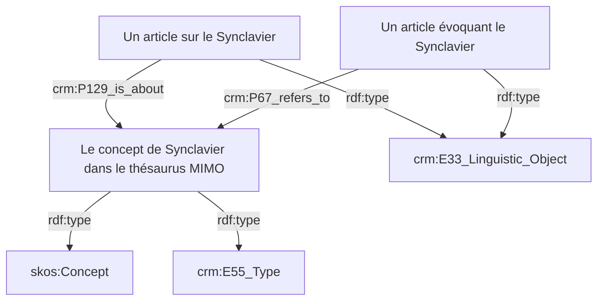
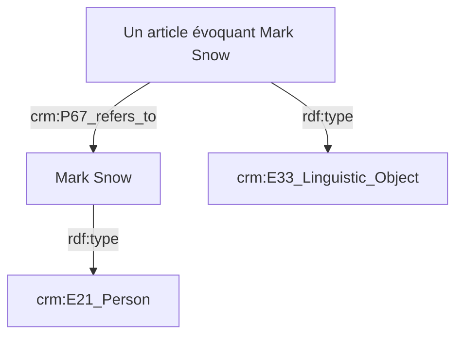

# Modèle SHERLOCK d'indexation des ressources

## Propriétés du CRM pour l'indexation

Deux propriétés du CRM permettent de réaliser l'indexation :

- `crm:P67_refers_to` (*renvoie à*) : Cette propriété documente qu'une instance de `crm:E89_Propositional_Object` contient un énoncé à propos d'une instance de `crm:E1_CRM_Entity` [🔗](https://cidoc-crm.org/html/cidoc_crm_v7.1.3.html#P67).
- `crm:P129_is_about` : Cette propriété documente documente qu'une instance de `crm:E89_Propositional_Object` a pour sujet une instance de `crm:E1_CRM_Entity`. [🔗](https://cidoc-crm.org/html/cidoc_crm_v7.1.3.html#P129).

L'indexation peut être réalisée avec un descripteur contrôlé issu d'un thésaurus (un `skos:Concept`/`crm:E55_Type`) ou avec une entité nommée (n'importe quelle `crm:E1_CRM_Entity`, mais plus particulièrement une `crm:E21_Person`, `crm:E53_Place` ou encore un `crm:E74_Group`).

## Exemples d'indexation avec un `skos:Concept`/`crm:E55_Type`

## Exemple d'indexation avec une entité nommée

