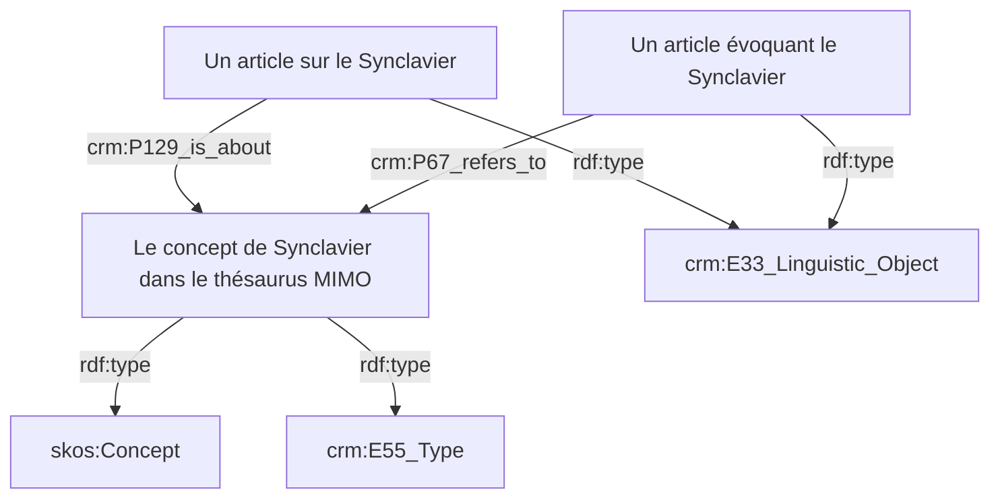
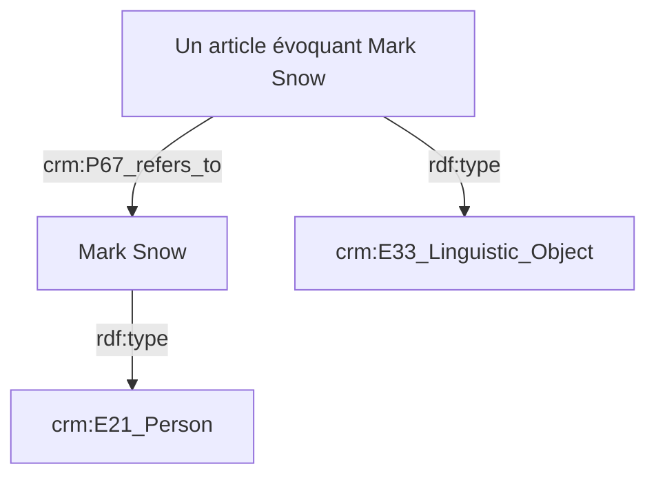
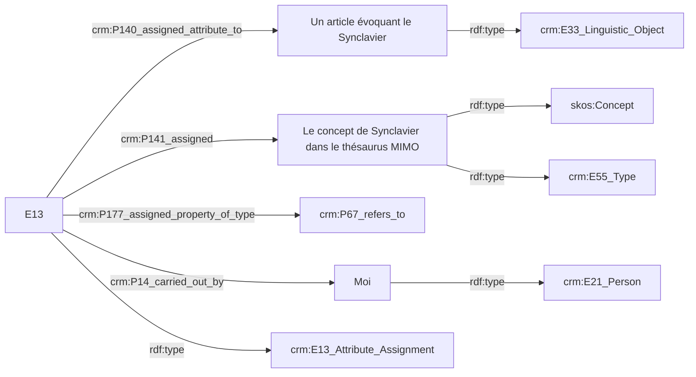
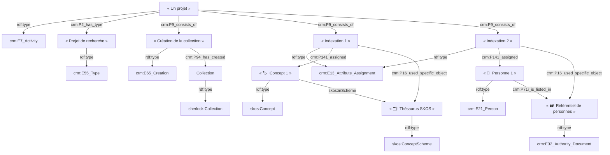

# `🗃️ SHERLOCK : Modèle d'indexation avec le CRM`

## `🔍 Propriétés du CRM pour l'indexation`

Deux propriétés du CRM permettent de réaliser l'indexation :

- `crm:P67_refers_to` (_renvoie à_) : Cette propriété documente qu'une instance
  de `crm:E89_Propositional_Object` contient un énoncé à propos d'une instance
  de `crm:E1_CRM_Entity`
  [🔗](https://cidoc-crm.org/html/cidoc_crm_v7.1.3.html#P67).
- `crm:P129_is_about` : Cette propriété documente qu'une instance de
  `crm:E89_Propositional_Object` a pour sujet une instance de
  `crm:E1_CRM_Entity`
  [🔗](https://cidoc-crm.org/html/cidoc_crm_v7.1.3.html#P129).

L'indexation peut être réalisée avec un concept issu d'un thésaurus (un
`skos:Concept`/`crm:E55_Type`) ou avec une entité nommée (n'importe quelle
`crm:E1_CRM_Entity`, mais plus particulièrement une `crm:E21_Person`,
`crm:E53_Place` ou encore un `crm:E74_Group`).

## `🏷️ Exemples d'indexation avec un concept`

## `🤵 Exemple d'indexation avec une entité nommée`

## `🧑‍🔬 Exemples d'indexation via une annotation`

La propriété utilisée pour établir le lien d'indexation (`crm:P67_refers_to`,
`crm:P129_is_about`) devient la valeur désignée par la propriété
`crm:P177_assigned_property_of_type`. Remarquons que dans le CRM, toutes les
propriétés sont des `crm:E55_Type`, ce qui permet de les utiliser comme objets
de triplets dont le prédicat est `crm:P177_assigned_property_of_type`.

## `⛩️ Référentiels et annotations dans le contexte des projets`

Les index sont regroupées dans des référentiels :

|   Type de l'index   |     Type du référentiel      | Propriété liant l'index à son référentiel |
| :-----------------: | :--------------------------: | :---------------------------------------: |
|   `skos:Concept`    |     `skos:ConceptScheme`     |              `skos:inScheme`              |
| `crm:E1_CRM_Entity` | `crm:E32_Authority_Document` |          `crm:P71i_is_listed_in`          |

Dans la perspective d'une documentation du processus scientifique, on peut
vouloir exprimer que tel projet de recherche recourt à tels référentiels pour
indexer telle collection.

Note : à des fins de lisibilité, les propriétés des annotations E13 `crm:P140_assigned_attribute_to` et `crm:P177_assigned_property_of_type` ne sont pas représentées sur ce diagramme.